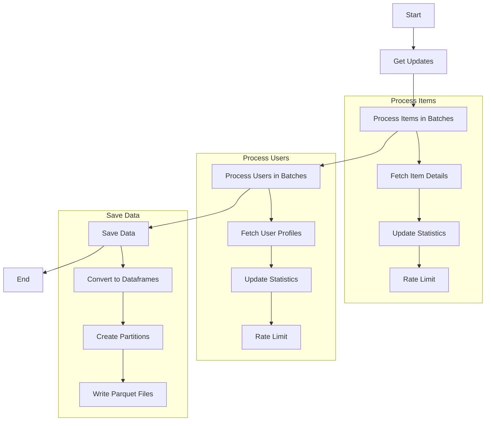

# Metaflow Flows 

## Overview



## Output Structure

```
data/raw/
  ├── stories/
  │   └── year=2024/month=01/day=15/
  │       └── 20240115_123456.parquet
  ├── comments/
  │   └── year=2024/month=01/day=15/
  │       └── 20240115_123456.parquet
  └── users/
      └── year=2024/month=01/day=15/
          └── 20240115_123456.parquet
```
